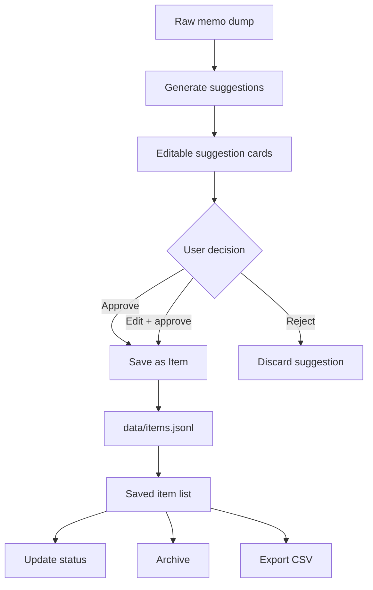
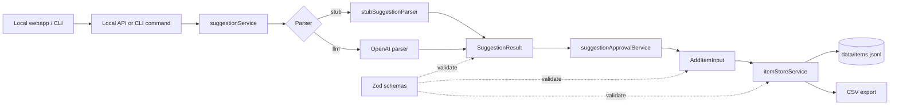

# MemoFlow

MemoFlow is a local-first TypeScript prototype for turning raw memo dumps into structured suggestions, then saving approved suggestions as durable items.

Current flow:

```text
raw memo
-> provisional suggestions
-> user review/edit/approve/reject
-> saved items
-> data/items.jsonl
```

No database, auth, cloud sync, RAG, reminders, or import integrations yet.

## Product Flow



## Architecture Flow



## Setup

```bash
npm install
cp .env.example .env
```

Fill in `.env` if you want to use the LLM parser:

```env
OPENAI_API_KEY=your_key_here
OPENAI_MODEL=gpt-4o-mini
```

The default `stub` parser works without an API key.

## Local Webapp

```bash
npm run dev
```

Open:

```text
http://127.0.0.1:3000
```

The webapp supports:

- raw memo input
- suggestion generation
- editable suggestion cards
- approve/reject
- saved item list
- status update
- archive

## CLI

Generate provisional suggestions:

```bash
npm run suggest -- "portfolio website"
npm run suggest -- --parser llm "周五买菜"
```

Review a dump interactively and save approved items:

```bash
npm run items -- review-dump "email Duke about final eval. also maybe memo app should support waiting status"
```

List saved items:

```bash
npm run items -- list
```

Add an item manually:

```bash
npm run items -- add --type task --title "Buy groceries" --due-date 2026-06-12
```

Update or archive:

```bash
npm run items -- update <id> --status done
npm run items -- archive <id>
```

Export CSV:

```bash
npm run items -- export-csv > items.csv
```

## Data

Saved items live in:

```text
data/items.jsonl
```

This repo includes one starter sample item. Real user data should remain local. `.env`, `dist/`, `node_modules/`, and `data/items.local.backup.jsonl` are ignored.

## Development

```bash
npm run check
npm run eval
```

Core source:

```text
src/services/suggestionService.ts
src/services/itemStoreService.ts
src/services/suggestionApprovalService.ts
src/webServer.ts
```

Suggestion definitions and examples:

```text
src/examples/suggestion_definitions.md
src/examples/dump2suggestions_few_shot_ex.md
```
