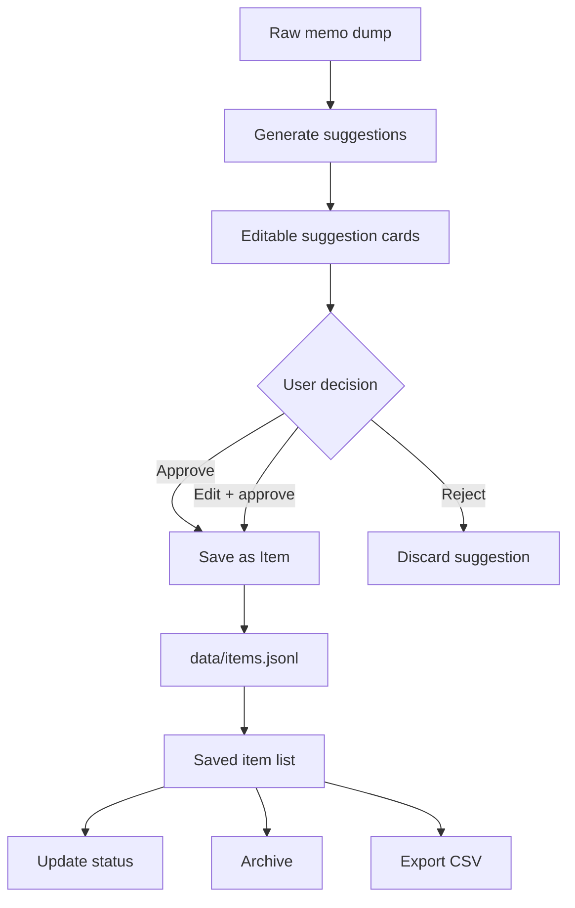
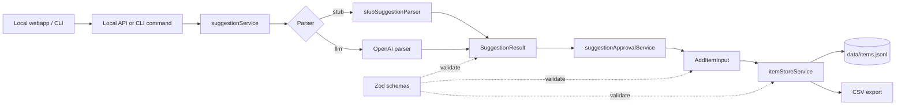

# MemoFlow

MemoFlow is a local-first TypeScript prototype for turning raw memo dumps into structured suggestions, then saving approved suggestions as durable items.

Current flow:

```text
raw memo
-> optional pending dump queue
-> provisional suggestions
-> user review/edit/approve/reject
-> saved items
-> data/items.jsonl
```

No database, auth, cloud sync, RAG, reminders, or import integrations yet.

## Product Flow



## Architecture Flow



## Setup

```bash
npm install
cp .env.example .env
```

Fill in `.env` if you want to use the LLM parser:

```env
OPENAI_API_KEY=your_key_here
OPENAI_MODEL=gpt-4o-mini
```

The default `stub` parser works without an API key.

## Local Webapp

```bash
npm run dev
```

Open:

```text
http://127.0.0.1:3000
```

The webapp supports:

- raw memo input
- freeform user memory
- quick dump save for later
- pending review list
- suggestion generation
- editable suggestion cards
- approve/reject
- saved item list
- deterministic item search/filter/sort
- status update
- archive

## CLI

Generate provisional suggestions:

```bash
npm run suggest -- "portfolio website"
npm run suggest -- --parser llm "周五买菜"
```

Save a raw dump for later review:

```bash
npm run items -- dump-save "email Duke about final eval"
npm run items -- dump-list
npm run items -- dump-review <dump_id>
npm run items -- dump-ignore <dump_id>
```

Review a dump interactively and save approved items:

```bash
npm run items -- review-dump "email Duke about final eval. also maybe memo app should support waiting status"
```

List saved items:

```bash
npm run items -- list
npm run items -- list --query duke
npm run items -- list --type task --status waiting
npm run items -- list --archived show --sort due_date_asc
npm run items -- list --archived only
```

Add an item manually:

```bash
npm run items -- add --type task --title "Buy groceries" --due-date 2026-06-12
```

Update or archive:

```bash
npm run items -- update <id> --status done
npm run items -- archive <id>
```

Export CSV:

```bash
npm run items -- export-csv > items.csv
npm run items -- export-csv --query duke --sort updated_at_desc > items.csv
```

Item ledger browsing is deterministic. Search, filters, and sort do not use
LLMs, embeddings, semantic search, RAG, auto-tagging, or grouping.

MemoFlow also supports freeform user memory stored locally in `data/memory.jsonl`.
Memory is user-created and user-controlled: the LLM does not automatically
extract, rewrite, classify, or create memory. In the web UI, `Use memory` is off
by default; when enabled, active non-archived memory entries are injected into
suggestion generation as lightweight context. Archived memory is hidden by
default and is not used in prompts. This is not RAG, embedding retrieval, or
automatic memory management.

Status display note: item statuses are stored as raw values, but the web ledger
displays the default per-type states `ready`, `open`, and `saved` as `ready`.
Follow-up is represented with fields such as `follow_up_date` and `waiting_on`,
not a normal `follow_up` status.

## Data

Saved items live in:

```text
data/items.jsonl
```

Pending raw dumps live in:

```text
data/dumps.jsonl
```

Freeform memory entries live in:

```text
data/memory.jsonl
```

This repo includes one starter sample item. Real user data should remain local. `.env`, `dist/`, `node_modules/`, and `data/items.local.backup.jsonl` are ignored.

## Development

```bash
npm run check
npm run eval
npm run eval:items
npm run eval:memory
```

Core source:

```text
src/services/suggestionService.ts
src/services/itemStoreService.ts
src/services/suggestionApprovalService.ts
src/webServer.ts
```

Suggestion definitions and examples:

```text
src/examples/suggestion_definitions.md
src/examples/dump2suggestions_few_shot_ex.md
```
