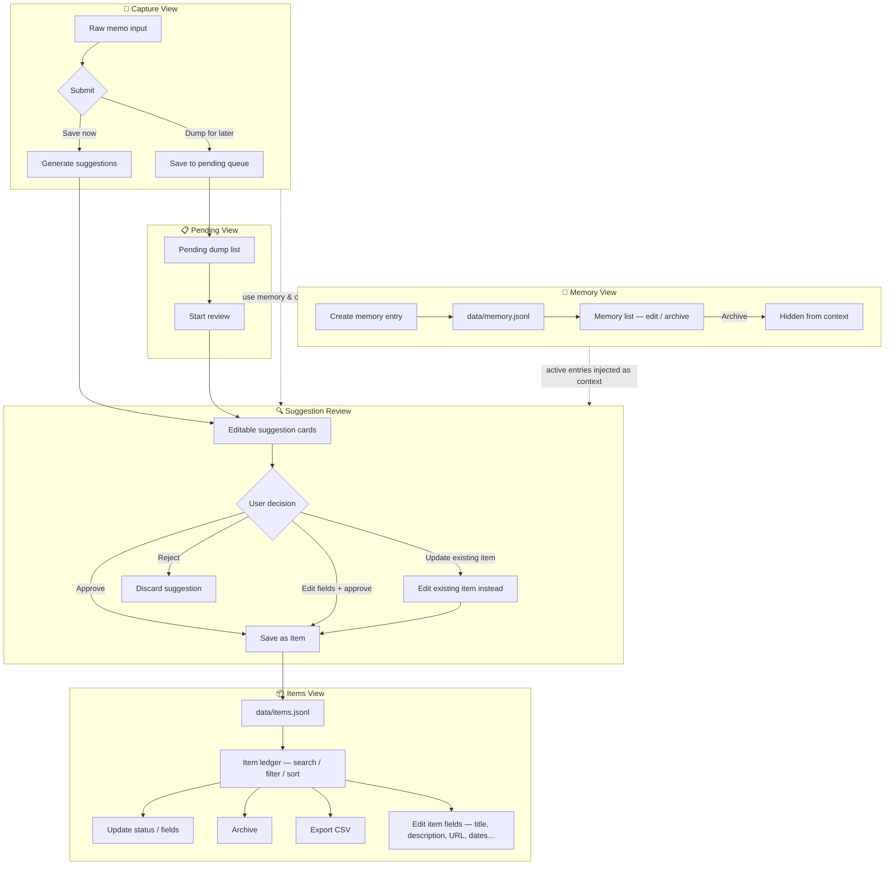
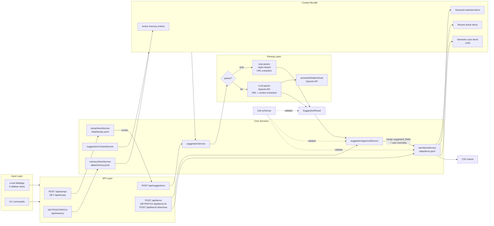
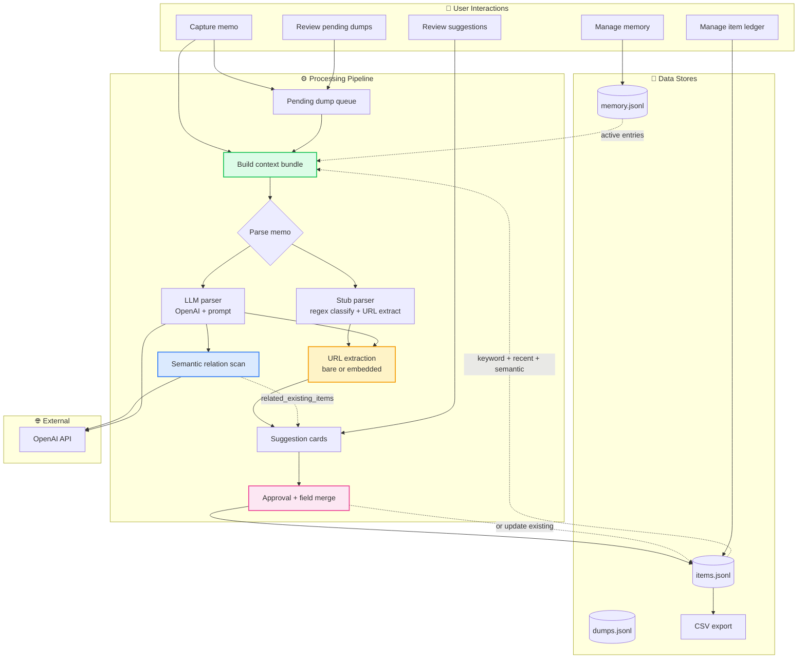

# MemoFlow Flowcharts

## 1. User Flow (Product)

```mermaid
flowchart TD
  subgraph Capture["🎤 Capture View"]
    A[Raw memo input] --> B{Submit}
    B -->|Save now| C[Generate suggestions]
    B -->|Dump for later| D[Save to pending queue]
  end

  subgraph Pending["📋 Pending View"]
    D --> E[Pending dump list]
    E --> F[Start review]
  end

  subgraph Review["🔍 Suggestion Review"]
    C --> G[Editable suggestion cards]
    F --> G
    G --> H{User decision}
    H -->|Approve| I[Save as Item]
    H -->|Edit fields + approve| I
    H -->|Update existing item| J[Edit existing item instead]
    H -->|Reject| K[Discard suggestion]
    J --> I
  end

  subgraph Items["📦 Items View"]
    I --> L[data/items.jsonl]
    L --> M[Item ledger — search / filter / sort]
    M --> N[Update status / fields]
    M --> O[Archive]
    M --> P[Export CSV]
    M --> Q[Edit item fields — title, description, URL, dates…]
  end

  subgraph Memory["🧠 Memory View"]
    R[Create memory entry] --> S[data/memory.jsonl]
    S --> T[Memory list — edit / archive]
    T -->|Archive| U[Hidden from context]
  end

  Capture -. "use memory & context" .-> Review
  Memory -. "active entries injected as context" .-> Review
```

## 2. Architecture Flow

```mermaid
flowchart LR
  subgraph Input["Input Layer"]
    UI[Local Webapp<br/>4 sidebar views]
    CLI[CLI commands]
  end

  subgraph API["API Layer"]
    DumpsAPI["POST /api/dumps<br/>GET /api/dumps"]
    SuggestAPI["POST /api/suggestions"]
    ItemsAPI["POST /api/items<br/>GET/PATCH /api/items/:id<br/>POST /api/items/:id/archive"]
    MemoryAPI["GET/POST/PATCH<br/>/api/memory"]
  end

  subgraph Core["Core Services"]
    DumpStore[dumpStoreService<br/>data/dumps.jsonl]
    SuggestionSvc[suggestionService]
    ApprovalSvc[suggestionApprovalService]
    ContextSvc[suggestionContextService]
    ItemStore[itemStoreService<br/>data/items.jsonl]
    MemoryStore[memoryStoreService<br/>data/memory.jsonl]
  end

  subgraph Parsing["Parsing Layer"]
    Parser{parser?}
    Stub[stub parser<br/>regex-based<br/>URL extraction]
    LLM[LLM parser<br/>OpenAI API<br/>URL + context extraction]
    SemanticScan[semanticRelationScan<br/>OpenAI API]
  end

  subgraph Context["Context Bundle"]
    ActiveMem[Active memory entries]
    KeywordItems[Keyword-matched items]
    RecentItems[Recent active items]
    SemanticItems[Semantic scan items<br/>≤100]
  end

  UI --> API
  CLI --> API

  DumpsAPI --> DumpStore
  SuggestAPI --> SuggestionSvc
  ItemsAPI --> ApprovalSvc
  ItemsAPI --> ItemStore
  MemoryAPI --> MemoryStore

  DumpStore -->|"review"| SuggestAPI

  SuggestionSvc --> Parser
  Parser -->|stub| Stub
  Parser -->|llm| LLM
  LLM --> SemanticScan

  Stub --> SuggestionResult[SuggestionResult]
  LLM --> SuggestionResult

  ContextSvc --> Context
  Context --> SuggestionSvc

  MemoryStore --> ActiveMem
  ItemStore --> KeywordItems
  ItemStore --> RecentItems
  ItemStore --> SemanticItems

  SuggestionResult --> ApprovalSvc
  ApprovalSvc -->|"merge suggested_fields<br/>+ user overrides"| ItemStore
  ItemStore --> CsvExport[CSV export]

  Schemas[Zod schemas] -. validate .-> SuggestionResult
  Schemas -. validate .-> ApprovalSvc
  Schemas -. validate .-> ItemStore
```

## 3. Combined — Full System Overview

```mermaid
flowchart TB
  subgraph User["👤 User Interactions"]
    direction LR
    Capture[Capture memo]
    PendingReview[Review pending dumps]
    SuggestReview[Review suggestions]
    ManageItems[Manage item ledger]
    ManageMemory[Manage memory]
  end

  subgraph Data["💾 Data Stores"]
    direction LR
    DumpsFile[(dumps.jsonl)]
    ItemsFile[(items.jsonl)]
    MemoryFile[(memory.jsonl)]
    CsvFile[CSV export]
  end

  subgraph Processing["⚙️ Processing Pipeline"]
    direction TB
    DumpQueue[Pending dump queue]
    ContextBuild[Build context bundle]
    Parse{Parse memo}
    StubParse[Stub parser<br/>regex classify + URL extract]
    LLMParse[LLM parser<br/>OpenAI + prompt]
    SemScan[Semantic relation scan]
    Suggest[Suggestion cards]
    Approve[Approval + field merge]
    URLExtract[URL extraction<br/>bare or embedded]
  end

  subgraph External["🌐 External"]
    OpenAI[OpenAI API]
  end

  Capture --> DumpQueue
  Capture --> ContextBuild
  PendingReview --> DumpQueue
  DumpQueue --> ContextBuild

  ContextBuild --> Parse
  MemoryFile -. "active entries" .-> ContextBuild
  ItemsFile -. "keyword + recent + semantic" .-> ContextBuild

  Parse --> StubParse
  Parse --> LLMParse

  StubParse --> URLExtract
  LLMParse --> URLExtract
  URLExtract --> Suggest

  LLMParse --> SemScan
  SemScan --> OpenAI
  LLMParse --> OpenAI
  SemScan -. "related_existing_items" .-> Suggest

  SuggestReview --> Suggest
  Suggest --> Approve
  Approve --> ItemsFile
  Approve -. "or update existing" .-> ItemsFile

  ManageItems --> ItemsFile
  ManageMemory --> MemoryFile
  ItemsFile --> CsvFile

  style URLExtract fill:#fef3c7,stroke:#f59e0b,stroke-width:2px
  style SemScan fill:#dbeafe,stroke:#3b82f6,stroke-width:2px
  style ContextBuild fill:#dcfce7,stroke:#22c55e,stroke-width:2px
  style Approve fill:#fce7f3,stroke:#ec4899,stroke-width:2px
```
